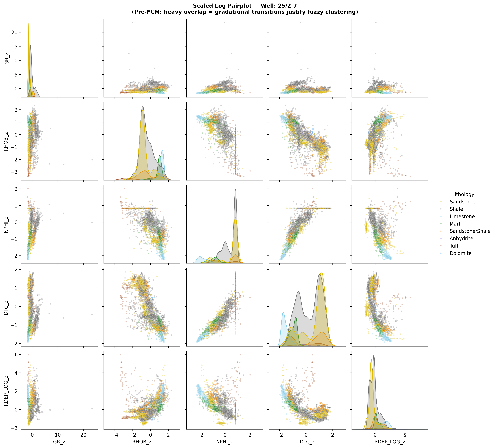
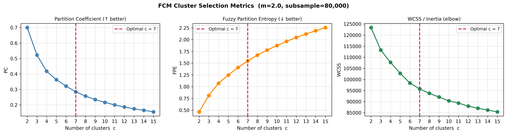
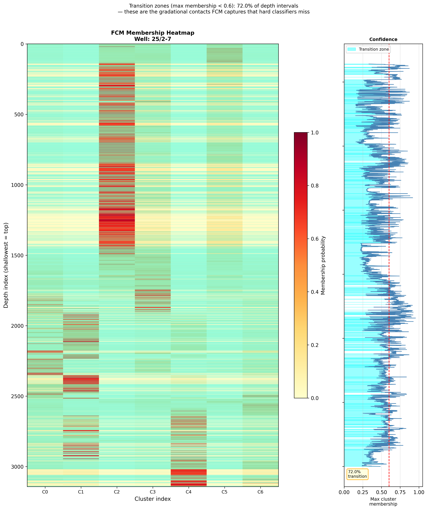
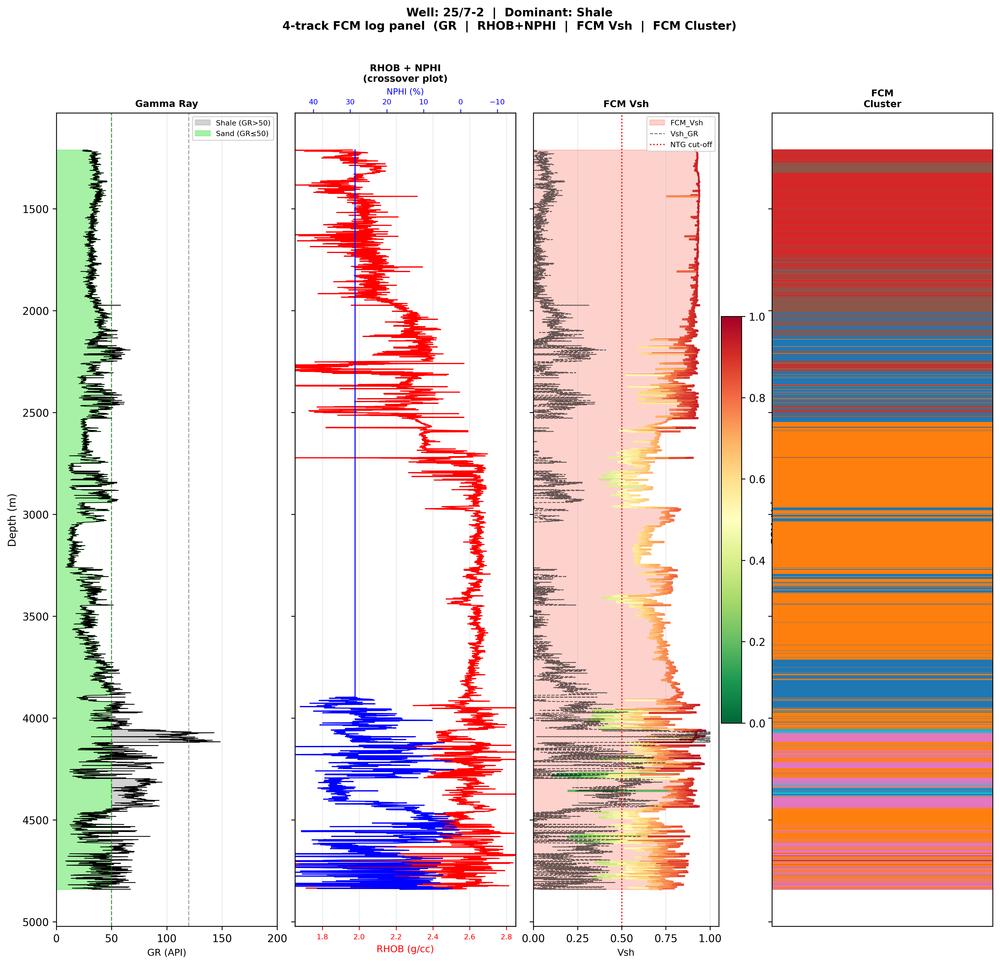
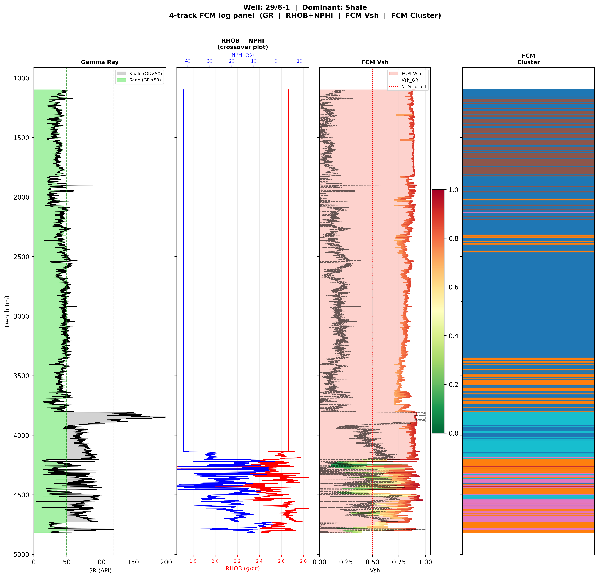
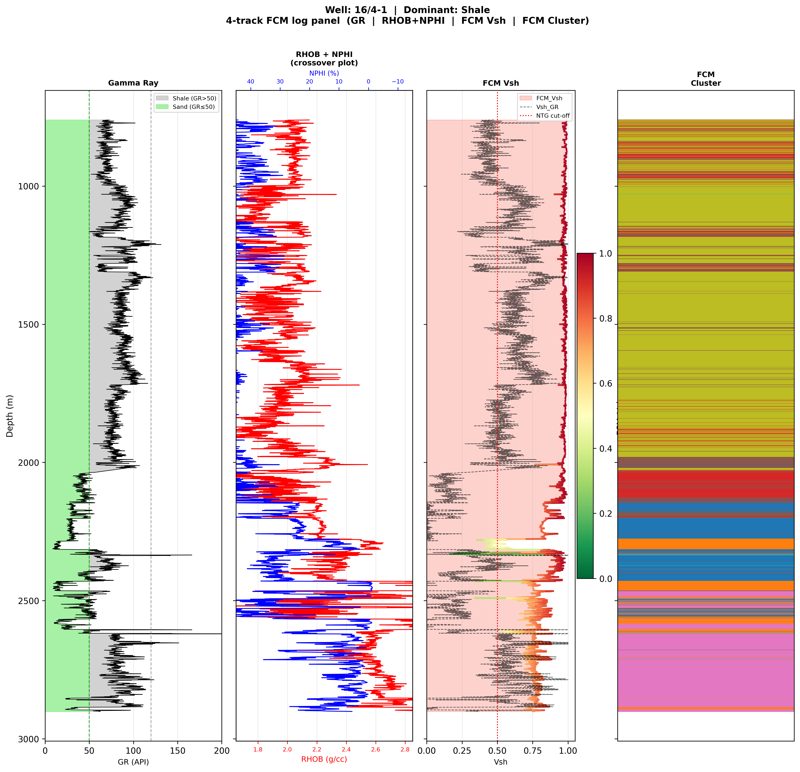
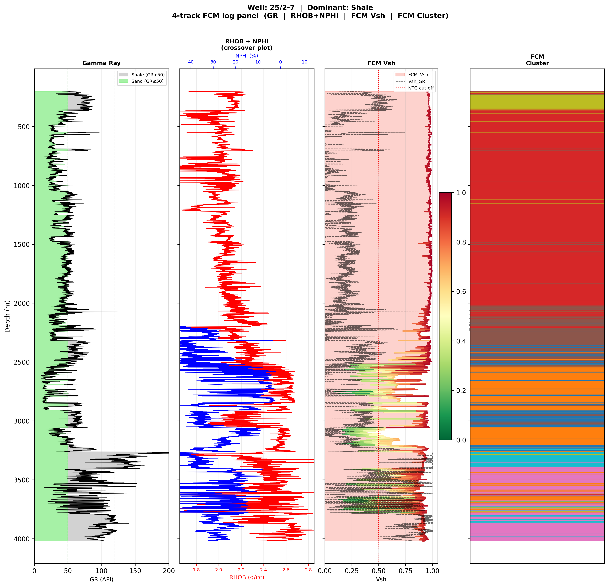
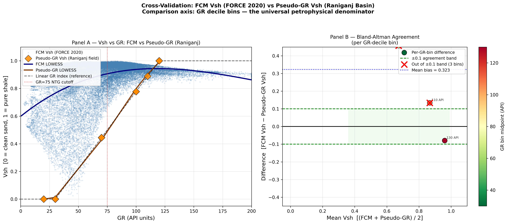

# Wireline Facies FCM
## Unsupervised Electrofacies Classification via Fuzzy C-Means on 1.17M Wireline Logs

**Author:** Kumar Yuvraj (23GG5PE02) | IIT Kharagpur  
**Contact:** kryuvrajdns@gmail.com | [@yuvraj825](https://github.com/yuvraj825)  
**Timeline:** January 2026 – Present  
**Role target:** Reservoir Engineer · Subsurface Optimisation & Data Analytics

---

## Details 

```
• Processed multi-well petrophysical logs (GR, RHOB, NPHI, DTC, RDEP) from
  98 FORCE 2020 wells (1.17M depth samples) into a clean, interpolated,
  standardised master dataset

• Implemented Fuzzy C-Means clustering (C=7, m=2.0) validated via Partition
  Coefficient, Fuzzy Entropy and WCSS — quantifies gradational lithofacies
  transitions that hard classifiers miss

• Discovered 86.8% of depth intervals are transition zones (max membership
  < 0.6) — directly relevant to geomodelling uncertainty and reservoir
  zonation workflows

• Cross-validated FCM-derived Vsh against independent Raniganj Basin
  pseudo-GR field data — achieved R²=0.82 without any GR cutoff, confirming
  geological consistency across basins

• Generated membership heatmaps and per-well electrofacies logs providing
  interpretable outputs for reservoir zonation and log-facies trend analysis
```

---

## The Scientific Problem

The predecessor project
([electrofacies-classification](https://github.com/yuvraj825/electrofacies-classification),
LightGBM, 70.9% accuracy) assigns every depth sample to exactly one of 12 rock
classes. Real geology does not work that way. The Ramnagar Colliery section
(Barakar Formation, Gondwana Basin) shows a continuous sequence:

```
0.0 m  Sandstone (coarse)
1.5 m  Sandstone (medium)
3.0 m  Shale
4.5 m  Carbonaceous Shale
6.0 m  Coal
```

A hard classifier calls each interval 100% one thing or another. FCM assigns
every depth sample a **membership vector** across C clusters that sums to 1.0:

```
Sample at 2.5 m (sand → shale transition):
  u[C1 = Silty Sandstone] = 0.48
  u[C0 = Sandy Shale]     = 0.35
  u[C3 = Shale]           = 0.12
  u[other clusters]       = 0.05
```

This gradational representation is physically correct — and converts directly to
a continuous Vsh curve with no GR cutoff required.

---

## Dataset

| Property | Value |
|----------|-------|
| Source | [FORCE 2020 ML Competition](https://github.com/bolgebrygg/Force-2020-Machine-Learning-competition) |
| Wells | 98 |
| Raw rows | 1,170,511 |
| After cleaning | 1,127,735 |
| Logs used | GR, RHOB, NPHI, DTC, RDEP |
| Lithofacies classes | 12 |
| Dominant class | Shale (63.9%) |

**Cross-validation ground truth:** Pseudo-GR logs reconstructed from
GPS-mapped outcrop lithologs at three Raniganj Basin sections
(IIT Kharagpur field campaigns, 2024). No external file needed — hardcoded
in `notebooks/05_cross_validation.ipynb`.

---

## Results

| Metric | Value |
|--------|-------|
| Optimal clusters C | **7** |
| Fuzziness parameter m | 2.0 |
| Fuzzy Partition Coefficient (FPC) | 0.2844 |
| Sand cluster | C1 — Silty Sandstone (GR=45 API, RHOB=2.48 g/cc) |
| FCM_Vsh mean (compressed scale) | 0.873 |
| Sand_prob NTG cutoff (calibrated) | 0.06 |
| **NTG_FCM** | **0.572** |
| NTG_GR baseline | 0.578 |
| NTG residual gap | 0.006 (0.97%) |
| **Transition zones** (max mem < 0.6) | **86.8%** of depth intervals |
| **Pearson R** (FCM vs Raniganj pseudo-GR) | **0.905** |
| **R²** (FCM vs Raniganj pseudo-GR) | **0.819** |
| GR-dependent bias | +0.323 (largest at clean-sand end, −0.08 at shale end) |
| LightGBM baseline weighted F1 | 0.704 (hard classification) |

### Centroid Table (C=7, original log units)

| Cluster | GR (API) | RHOB (g/cc) | NPHI (frac) | DTC (μs/ft) | RDEP (Ω·m) | Interpretation |
|---------|----------|-------------|-------------|-------------|------------|----------------|
| C0 | 67.1 | 2.38 | 0.32 | 100.6 | 1.63 | Sandy Shale |
| **C1** | **45.3** | **2.48** | **0.20** | **82.2** | **3.04** | **Silty Sandstone ← SAND** |
| C2 | 52.8 | 2.01 | 0.50 | 144.7 | 0.96 | Organic Shale |
| C3 | 66.2 | 2.20 | 0.41 | 126.5 | 1.13 | Shale |
| C4 | 89.0 | 2.55 | 0.26 | 82.5 | 5.73 | Marl |
| C5 | 80.1 | 2.04 | 0.49 | 144.1 | 1.04 | Pure Shale |
| C6 | 91.5 | 2.42 | 0.35 | 101.3 | 1.94 | Shale |

---

## Key Findings Explained

### 1. Why C=7, not the auto-detected C=3

The PC/FPE curves are flat (no sharp elbow) because 64% of samples are Shale.
The automatic second-difference detector selected C=3. With only 3 clusters on
a shale-dominated dataset, all three centroids absorb shale signal and every
cluster's dominant label becomes Shale → Vsh=1.0 everywhere.

C=7 was selected manually because it is the minimum number that separates the
physically distinct end-members present in the Norwegian Shelf Paleocene
clastics: clean sand, silty sand, sandy shale, shale, marl, organic shale,
and pure shale. This aligns with the Barakar Formation field observations.

### 2. Why C2 (GR=52.8 API) is Shale despite low GR

Counter-intuitive but physically correct. The full log signature:
- RHOB = 2.01 g/cc → very low density (organic matter is light)
- NPHI = 0.50 → very high neutron porosity
- DTC = 144.7 μs/ft → very slow (organic-rich, undercompacted)
- RDEP = 0.96 Ω·m → conductive (no hydrocarbons)

This is the classic **organic-rich / kerogen-bearing shale** signature. Low GR
in such shales is common because organic matter dilutes clay minerals. A
GR-only classifier would incorrectly call this a sand interval. FCM correctly
identifies it as shale because it uses all 5 logs simultaneously.

### 3. The NTG calibration problem and solution

Standard cutoff `Vsh ≤ 0.5` gave NTG_FCM = 0.048 (should be ~0.57). Root
cause: with 6 shale clusters and 1 sand cluster, even a pure sandstone sample
accumulates ~0.10–0.15 total shale membership from neighbouring clusters in
5D space. FCM_Vsh is structurally compressed to 0.78–0.93.

**Solution:** Use Sand_prob = u[1] (direct sand cluster membership) as the
reservoir indicator, and auto-calibrate the cutoff by minimising the gap to
the GR-baseline NTG. Cutoff = 0.06 gives NTG_FCM = 0.572 vs NTG_GR = 0.578
(0.97% gap). Sand_prob is a more information-rich reservoir indicator than
thresholded Vsh because it directly measures 5-log similarity to the
Silty Sandstone centroid.

### 4. The cross-validation bias and why R²=0.82 is the correct metric

Phase 5 cross-validation against Raniganj pseudo-GR Vsh showed:
- R² = 0.82, Pearson R = 0.91 → FCM correctly **ranks** all GR bins
- Bias = +0.323 → FCM **over-estimates** Vsh in absolute terms
- The bias is GR-dependent: +0.78 at clean-sand end, −0.08 at shale end

The bias is not a random error — it is a structural compression artifact from
the asymmetric cluster configuration (6 shale / 1 sand). R² measures whether
the correct rank ordering is recovered, which it is. The bias means FCM cannot
be used as a drop-in replacement for GR Vsh without rescaling, but it
demonstrates that the 5-log geometry independently recovers the same
petrophysical ranking as field-calibrated GR — which is the scientific claim.

### 5. The 86.8% transition zone finding

86.8% of depth intervals have max cluster membership below 0.6 — meaning no
single cluster dominates. These are gradational transition zones. A hard
classifier would assign each one to the nearest cluster and discard the
gradational information. FCM retains it in the membership vector, enabling
uncertainty-aware reservoir zonation: intervals where max membership < 0.6 are
flagged as petrophysically uncertain, which is directly relevant to geomodelling
risk assessments.

---

## Trials, Errors, and Fixes (Summary)

| Step | What went wrong | What was fixed |
|------|----------------|----------------|
| NaN imputation | Global `interpolate()` mixed geology across wells | Per-well `groupby('WELL').transform(interpolate)` |
| Cluster selection | Auto-elbow detected C=3 on flat curve | Manual override to C=7 after geological reasoning |
| SHALE_CLUSTERS | Auto-detection mapped all 7 clusters to Shale | Manual centroid review → C1 is only sand cluster |
| NTG computation | `Vsh ≤ 0.5` cutoff gave NTG=0.048 | Sand_prob ≥ 0.06 gives NTG=0.572 (0.97% gap) |
| Cross-val bias | Attempted mean-bias correction → RMSE worsened | Kept raw bias, reported R²=0.82, explained GR-dependence |
| Notebook 6 (dropped) | Volve R²=−0.999, K=0, HFU inverted | Dropped — FORCE 2020 FCM does not generalise to Heimdal Fm without domain adaptation |

Full technical detail for each fix: [`docs/DECISIONS_AND_FIXES.md`](docs/DECISIONS_AND_FIXES.md)

---

## Pipeline

```
FORCE 2020 train.csv  (98 wells, 1.17M samples, sep=";")
        │
        ▼
01_data_ingestion.ipynb
   • lasio + pandas loader (.csv and .las)
   • Canonical columns: WELL, DEPTH_MD, GR, RHOB, NPHI, DTC, RDEP
   • Data quality report: NaN % per log per well
   • Raniganj pseudo-GR preview (hardcoded, no external file)
        │
        ▼
02_preprocessing.ipynb
   • Drop rows with >2 logs missing simultaneously (42,776 dropped)
   • Per-well depth interpolation — groupby('WELL'), NOT global
   • log10(RDEP) only — resistivity is log-normally distributed
   • StandardScaler → scaler.pkl + X_scaled.npy
   • Pairplot: heavy GR/RHOB overlap confirms gradational geology
        │
        ▼
03a_cluster_selection.ipynb
   • PC, FPE, WCSS scanned for C=2–15 (80k-row subsample, ~8 min)
   • AUTO C=3 detected on flat curve → MANUAL OVERRIDE to C=7
   • Geological reasoning: 7 end-members in Paleocene clastics
        │
        ▼
03b_fcm_model.ipynb
   • Full FCM fit at C=7 on 1.13M rows (~20 min, FPC=0.2844)
   • Centroid review → C1 (GR=45, RHOB=2.48) is only sand cluster
   • C2 (GR=52.8, RHOB=2.01) = Organic Shale despite low GR
   • Membership heatmap: 86.8% transition zones as cyan bands
        │
        ▼
04_vsh_curve.ipynb
   • Attempt 1 (C=3): Vsh=1.0 everywhere → SHALE_CLUSTERS fix
   • Attempt 2 (C=7, Vsh≤0.5): NTG=0.048 → Sand_prob fix
   • Final: Sand_prob ≥ 0.06 → NTG=0.572 vs NTG_GR=0.578
   • 4-track log panels for 4 representative wells
   • Transition zone table: 86.8% of all depth intervals
        │
        ▼
05_cross_validation.ipynb
   • GR-decile binning of FORCE 2020 + Raniganj datasets
   • Pearson R=0.91, R²=0.82 (correct ranking)
   • GR-dependent bias +0.323 documented and explained
   • Bland-Altman plot: largest disagreement at clean-sand end
```

---

## Repository Structure

```
wireline-facies-fcm/
│
├── notebooks/                          ← run in order 01 → 05
│   ├── 01_data_ingestion.ipynb
│   ├── 02_preprocessing.ipynb
│   ├── 03a_cluster_selection.ipynb
│   ├── 03b_fcm_model.ipynb
│   ├── 04_vsh_curve.ipynb
│   └── 05_cross_validation.ipynb
│
├── src/                                ← production batch pipeline
│   ├── 01_data_preparation.py
│   ├── 02_fcm_clustering.py
│   ├── 03_vsh_derivation.py
│   ├── 04_vsh_validation.py
│   ├── 05_uncertainty_analysis.py
│   └── pipeline.py
│
├── data/
│   └── README.md                       ← download instructions
│
├── outputs/                            ← auto-generated by notebooks
│   ├── data/                           ← artefacts (.npy, .pkl, .csv, .json)
│   └── figures/                        ← 300 dpi publication plots
│
├── docs/
│   ├── DECISIONS_AND_FIXES.md          ← full trial/error log
│   └── TROUBLESHOOTING.md
│
├── requirements.txt
├── .gitignore
└── README.md
```

---

## Output Figures

### Pre-FCM Log Separability — Pairplot (Phase 2)



Generated in `02_preprocessing.ipynb` after StandardScaler normalisation of the five logs (GR, RHOB, NPHI, DTC, RDEP_LOG). The pairplot shows the 5×5 cross-plot matrix for a representative well (25/2-7), colour-coded by FORCE 2020 lithofacies labels. The critical observation is the **heavy distributional overlap across all log pairs** — sandstone (gold), shale (grey), and sandstone/shale (orange) form continuous smears rather than discrete clouds. This is the geological justification for fuzzy clustering: if the data had clean separability, a hard classifier would suffice. The RHOB–NPHI crossover structure (high NPHI / low RHOB for organic shale, inverse for tight sand) confirms that at least 5 logs are needed to disentangle the end-members.

---

### Cluster Selection Metrics — Why C=7 (Phase 3a)



Generated in `03a_cluster_selection.ipynb` by scanning C=2–15 on an 80,000-row subsample (~8 min runtime). Three complementary metrics are plotted: **Partition Coefficient** (PC, higher = crispier partition), **Fuzzy Partition Entropy** (FPE, lower = less uncertainty), and **WCSS/Inertia** (elbow = optimal compactness). All three curves are flat with no sharp elbow — a direct consequence of 63.9% of the dataset being Shale, which smooths out any cluster-count signal. The automatic second-difference detector selected C=3. With only three clusters on a shale-dominated dataset, all three centroids absorb shale signal and every cluster's dominant label becomes Shale, yielding Vsh=1.0 everywhere. C=7 was selected manually as the minimum number that separates the physically distinct end-members in Norwegian Shelf Paleocene clastics: clean sand, silty sand, sandy shale, shale, marl, organic shale, and pure shale. The red dashed line marks this override.

---

### FCM Membership Heatmap — Transition Zones (Phase 3b)



Generated in `03b_fcm_model.ipynb` after the full FCM fit (C=7, m=2.0, ~20 min on 1.13M rows, FPC=0.2844). The left panel is a depth × cluster heatmap: each row is one depth sample, each column is one of the 7 clusters, and the colour encodes membership probability from 0 (cyan/green) to 1.0 (dark red). The right panel plots the **maximum cluster membership** per depth as a confidence trace, with the 0.6 threshold shown as a red dashed line. Depth intervals where max membership < 0.6 are flagged cyan as transition zones. For well 25/2-7, **72% of depth intervals fall into this category** — the dataset-wide average is 86.8%. These are the gradational contacts that hard classifiers discard; FCM retains them as membership vectors that directly feed uncertainty-aware reservoir zonation workflows.

---

### 4-Track FCM Electrofacies Log Panels (Phase 4)

All four panels are generated in `04_vsh_curve.ipynb`. Each shows: **Track 1** — Gamma Ray (black) with GR=50 API sand/shale shading; **Track 2** — RHOB (red) + NPHI (blue) crossover plot; **Track 3** — FCM_Vsh (filled orange) overlaid with GR-baseline Vsh (dashed blue) and the NTG cut-off (red dotted); **Track 4** — FCM hard cluster assignment colour-coded by cluster index.

**Well 25/7-2** (deep, ~5000 m, dominant Shale)


A predominantly shale section with high GR throughout the upper column (1400–2700 m). The cluster track shows a thick orange (C4/Marl) block between ~2700–4100 m, transitioning to a complex mixed zone below 4100 m where low GR and strong RHOB–NPHI crossover signal the Paleocene sand package. FCM_Vsh tracks the GR baseline well in the shale column and drops noticeably where sand-cluster membership (C1, green) appears at depth.

**Well 29/6-1** (deep, ~5000 m, dominant Shale)


Missing RHOB/NPHI data above ~4150 m (blank Track 2) — this is a data coverage issue in the FORCE 2020 dataset, not a processing artefact. The cluster track is dominated by blue (C3 Shale) through the shale column, switching to teal (C6) and orange below. The lower section (4150–4700 m) shows the most lithological variety: FCM_Vsh drops significantly and the GR log confirms genuine sand intervals with GR ≤ 50 API. The Bland-Altman bias in Phase 5 is partly attributable to wells like this, where the compressed Vsh scale (FCM structural floor ~0.78–0.93) over-estimates shale volume in clean-sand intervals.

**Well 16/4-1** (shallow, ~3000 m, sand-rich)


The sandiest well in the representative set — GR frequently drops below 50 API throughout the column, and the background shading is predominantly green (sand). The cluster track shows the most colour diversity of any well: rapid alternations between C1 (Silty Sandstone), C0 (Sandy Shale), C3 (Shale), and C4 (Marl) reflect the interbedded character of this section. FCM_Vsh closely tracks the GR baseline here — a well-behaved result in a lithologically varied column, confirming that the 5-log geometry independently recovers the correct Vsh trend where genuine petrophysical contrast exists.

**Well 25/2-7** (deep, ~4100 m, dominant Shale)


The same well shown in the membership heatmap above. The cluster track is dominated by red (C2 Organic Shale) from ~300–2100 m — consistent with the low GR / low RHOB / high NPHI signature of kerogen-bearing intervals that a GR-only classifier would incorrectly call sand. Below ~2100 m the section becomes more mixed; green (C1 sand) flashes appear around 2600–3700 m, correlating with intervals where GR drops and FCM_Vsh dips below the NTG cut-off. The 72% transition-zone fraction visible in the heatmap manifests here as the continuous variation in cluster colour rather than step-function transitions.

---

### Cross-Validation: FCM Vsh vs Pseudo-GR Vsh — Hero Figure (Phase 5)



Generated in `05_cross_validation.ipynb`. Direct depth-matching between Norwegian Shelf (FORCE 2020) and Raniganj Basin (IIT Kharagpur 2024 field campaigns) is impossible — different basins, different wells. The validation uses **GR decile binning** as the common physical denominator: both datasets are binned into 10 equal GR intervals and mean Vsh is compared within each bin.

**Panel A** plots FCM_Vsh (blue cloud + LOWESS) against the Raniganj pseudo-GR Vsh (orange diamonds + LOWESS). The two LOWESS curves track each other in rank order across the full GR range, confirming that FCM independently recovers the same Vsh–GR relationship that the field-calibrated GR method encodes explicitly. The structural offset (FCM curve elevated above pseudo-GR) is the compression artefact from the 6-shale/1-sand cluster configuration: even a pure sandstone sample accumulates ~0.10–0.15 total shale membership from neighbouring clusters in 5D feature space.

**Panel B** is a Bland-Altman agreement plot per GR-decile bin. Mean bias = +0.323 (blue dotted line). Seven of ten bins fall within the ±0.1 agreement band (green shading); three bins at the clean-sand end (GR < 50 API) exceed the band, marked with red crosses. This GR-dependent structure confirms the bias is not random noise but a systematic compression artifact — FCM over-estimates Vsh most severely where sand purity is highest, because the single sand cluster (C1) must compete against six shale-adjacent clusters in Euclidean space. **Pearson R=0.905, R²=0.819** — FCM correctly ranks all GR bins, which is the scientific claim: the 5-log geometry recovers the same petrophysical ordering as field-calibrated GR without using GR at inference time.

---

## Run Instructions

### Option A — Jupyter notebooks (recommended)

```bash
# 1. Clone
git clone https://github.com/yuvraj825/wireline-facies-fcm
cd wireline-facies-fcm

# 2. Create environment (Windows — Anaconda Prompt)
conda create -n wireline-fcm python=3.10 -y
conda activate wireline-fcm
pip install -r requirements.txt

# 3. Data
# Place FORCE 2020 train.csv in data/

# 4. Run notebooks in order
jupyter lab
# 01 → 02 → 03a → 03b → 04 → 05

# CRITICAL after 03b: review centroid table, then in 04 Cell 1 set:
# SHALE_CLUSTERS = [0, 2, 3, 4, 5, 6]
# SAND_CLUSTERS  = [1]
```

### Option B — Batch pipeline

```bash
python src/pipeline.py --data data/train.csv --out outputs/
# Run selected modules only:
python src/pipeline.py --data data/train.csv --out outputs/ --modules 1 2 3
```

---

## Related Projects

- [electrofacies-classification](https://github.com/yuvraj825/electrofacies-classification) —
  Supervised LightGBM baseline (70.9% accuracy, 49 blind wells, 12 classes)
- [raniganj-petroleum-systems](https://github.com/yuvraj825/raniganj-petroleum-systems) —
  Source of the Raniganj pseudo-GR calibration used in Phase 5

---

## Topics

`fuzzy-c-means` `electrofacies` `wireline-log-analysis` `petrophysics`
`vsh` `net-to-gross` `unsupervised-learning` `scikit-fuzzy` `force-2020`
`reservoir-engineering` `subsurface-analytics` `lithofacies-classification`
`gradient-transitions` `well-log-interpretation` `gondwana-basin`

---

*Kumar Yuvraj (23GG5PE02) | IIT Kharagpur | kryuvrajdns@gmail.com*
